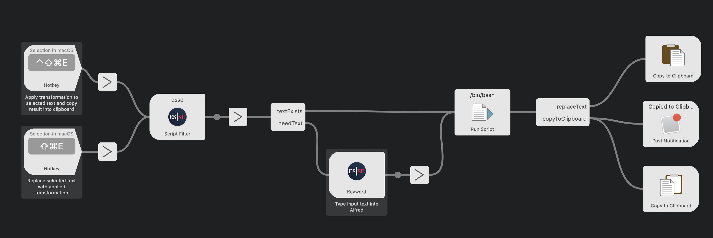

# Alfred Integration

[Direct download](https://github.com/amebalabs/Esse/releases) version of Esse is bundled with a command line tool, which allows a straightforward integration in Alfred workflow.

Command line interface:

```
OVERVIEW: Swiss army knife of text transformation.

USAGE: esse [-t <t>] [-i <i>] <subcommand>

OPTIONS:
  -t <t>                  Transformation(s) to execute.
  -i <i>                  Text to transform.
  --version               Show the version.
  -h, --help              Show help information.

SUBCOMMANDS:
  list                    Print list of available transformations.

  See 'esse help <subcommand>' for detailed help.
```

To populate Alfred's auto-suggest use this special subcommand:

```
EsseCommandLine list --alfred
```

And this is how you run a function:

```
EsseCommandLine -i "Cool input text" -t <function_id>
```
or 
```
echo "Cool input text" > EsseCommandLine -t <function_id>
```

# Alred Workflows
## Esse Workflow

### [Download](https://github.com/amebalabs/Esse/raw/master/Alfred/Esse.alfredworkflow)

This is the official workflow by Ameba Labs, providing the following functions:
Trigger | Action
------------ | -------------
CMD+SHIFT+E | Run Esse function for a selected text and replace it with transformation result
CTRL+CMD+SHIFT+E | Run Esse function for a selected text and put transofrmation into clipboard
*esse* in Alfred | Input text to transform directly into Alfred


