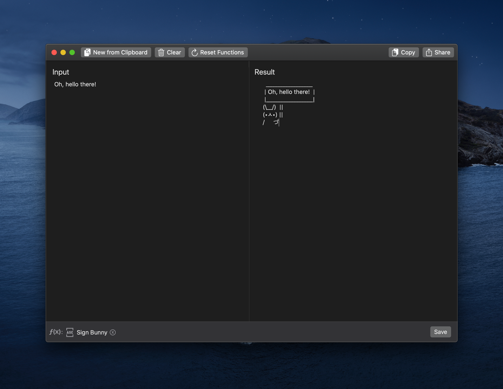

# Esse
Swiss army knife of text transformation for iOS and macOS
<p align="center">
  
</p>

This repository is used for:
* Esse for macOS releases hosting, you can download the latest version from [Releases](https://github.com/amebalabs/Esse/releases)
* Official [External Scripts](/Scripts) repository
* [Alfred Workflows](/Alfred)
* Other possible integrations and tweaks

# Installation

## Using [Homebrew](https://brew.sh)
```
brew tap melonamin/formulae
brew cask install esse
```
### Download

You can also install Esse by downloading from the [latest GitHub release](https://github.com/amebalabs/Esse/releases).

# How to contribute

* Create an issue with a bug report or request for a new external script.
* Create a pull request to fix a bug or propose a new external script.

# About

[Website](https://esse.ameba.co)

[Help](https://esse.ameba.co/help)

[Privacy Policy](https://esse.ameba.co/privacypolicy/)
